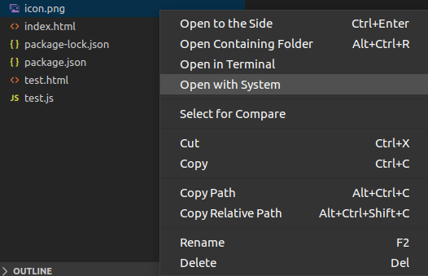

# Open From Explorer

Adds a context menu item to the File Explorer to run xdg-open. Only works on common linux systems.

## Features

## Requirements

- Restricted to Linux
- Depends on `xdg-open` and `xdg-mime`
- Limited functionality if `.desktop` files are not in `/usr/share/applications`

## Known Issues

No Windows or MacOS support

## Release Notes

### 0.1.0

Initial release
